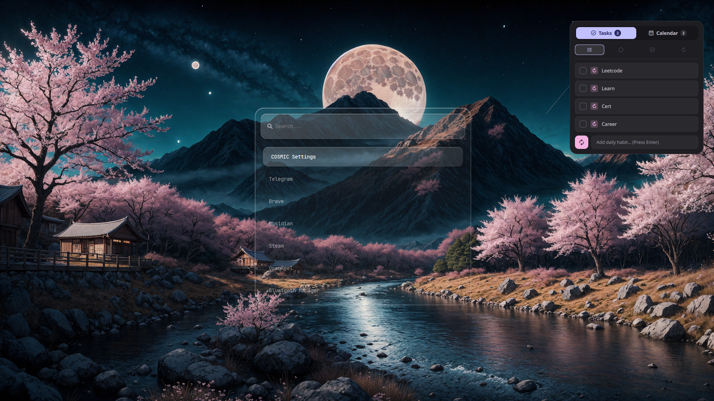

# wofi-glassmorphism

A premium **glass morphic** theme for [wofi](https://hg.sr.ht/~scoopta/wofi) — the Wayland application launcher.

## ✨ Features

- **True glass morphism** — translucent background with backdrop blur (requires compositor support)
- **Subtle depth** — layered shadows, highlight borders, inset glows
- **Smooth micro-interactions** — hover/selection transitions, staggered entry animations
- **Themeable via CSS variables** — change colors in one place (`:root`)
- **Respects system preferences** — high contrast, reduced motion
- **JetBrains Mono** — crisp, technical typography (falls back gracefully)
- **Zero dependencies** — pure CSS, works with stock wofi

## 📸 Preview



*Your screenshot here — replace `preview.png`*

## 🚀 Quick Install

```bash
git clone https://github.com/zius/wofi-glassmorphism
cd wofi-glassmorphism
chmod +x install.sh
./install.sh
```

Then bind a key (Hyprland example):
```conf
bindd = , SUPER, exec, wofi --show drun
```

## ⚙️ Requirements

| Component | Version | Notes |
|-----------|---------|-------|
| **wofi** | ≥ 1.3 | `pacman -S wofi` / `dnf install wofi` |
| **Compositor** | Any with backdrop blur | Hyprland, swayfx, KWin, picom (with blur backend) |
| **Font** | Optional | JetBrains Mono recommended; falls back to Noto Sans |

### Compositor Blur Setup

**Hyprland** (native):
```conf
# ~/.config/hypr/hyprland.conf
decoration {
    blur {
        enabled = true
        size = 8
        passes = 3
        new_optimizations = true
    }
}
windowrulev2 = blur, class:^(wofi-launcher)$
```

**swayfx**:
```conf
# ~/.config/sway/config
for_window [app_id="wofi-launcher"] blur_background 8 3
```

**Picom** (with `picom-ftlabs-git` or `picom-jonaburg-git`):
```conf
# ~/.config/picom.conf
blur {
    method = "dual_kawase";
    strength = 6;
}
```

## 🎨 Customization

Edit `style.css` — all colors live in `:root`:

```css
:root {
  --glass-bg:        rgba(15, 15, 20, 0.72);   /* Base glass */
  --glass-border:    rgba(255, 255, 255, 0.12); /* Border highlight */
  --accent:          #89b4fa;                    /* Your brand color */
  --accent-hover:    #74c7ec;
  --text-primary:    rgba(255, 255, 255, 0.92);
  --text-secondary:  rgba(255, 255, 255, 0.6);
  --radius-lg:       16px;
}
```

**Popular accent presets:**

| Theme | `--accent` | `--accent-hover` |
|-------|------------|------------------|
| Catppuccin Mocha | `#89b4fa` | `#74c7ec` |
| Rose Pine | `#eb6f92` | `#f6c177` |
| Tokyo Night | `#7aa2f7` | `#bb9af7` |
| Nord | `#88c0d0` | `#81a1c1` |
| Dracula | `#bd93f9` | `#ff79c6` |
| Gruvbox | `#fabd2f` | `#fe8019` |

## 📁 Structure

```
wofi-glassmorphism/
├── config              # wofi config (points to style.css)
├── styles/
│   └── style.css       # Main theme (edit this)
├── scripts/
│   └── preview.sh      # Generate preview (optional)
├── install.sh          # One-command installer
├── LICENSE
└── README.md
```

## 🔧 Advanced

### Multiple Modes

The config defaults to `drun` (applications). For other modes:

```bash
wofi --show run      # Command runner
wofi --show window   # Window switcher
wofi --show drun,run # Combined (cycle with Tab)
```

### Per-Mode Themes

Create `style-drun.css`, `style-run.css`, etc. and launch with:
```bash
wofi --show drun --conf ~/.config/wofi/config-drun
```

### Icons

Uses your GTK icon theme (`Papirus-Dark` by default). Change in `config`:
```ini
icon-theme=Your-Theme-Name
```

## 🤝 Contributing

PRs welcome for:
- New accent presets
- Additional compositor configs
- Animation refinements
- Accessibility improvements

## 📄 License

MIT — free for personal and commercial use.

## 🙏 Credits

- [wofi](https://hg.sr.ht/~scoopta/wofi) by Simon Ser
- Glass morphism inspiration: Apple Liquid Glass, Microsoft Mica, KDE Breeze
- Font: [JetBrains Mono](https://www.jetbrains.com/lp/mono/)

---

**Made with ☕ by [zius](https://github.com/zius)**